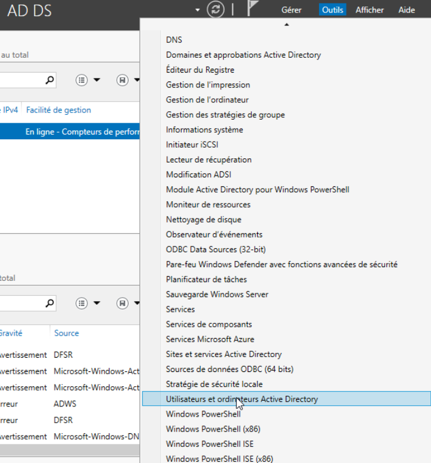

# Documentation d'exploitation - Projet Infrastructure & Système d'information

## Membres du projet

- Olivier MISTRAL
- Pierre ROY

## Table des matières

* [Présentation du projet](#présentation-du-projet)
* [Créer un utilisateur](#créer-un-utilisateur)
* [Créer une boite mail](#créer-une-boite-mail)

## Présentation du projet

Nous sommes Olivier MISTRAL et Pierre ROY, étudiants en deuxième année Bachelor a Ynov Informatique. Dans le cadre de
notre cours d'Infrastructure et Système d'Information, nous avons réalisé un projet de mise en place d'une
SI d'une entreprise fictive.    
Le présent document a pour but de présenter les différentes étapes pour exploiter
notre infrastructure. En particulier la création d'un utilisateur et d'une boite mail grâce à l'interface de
l'A.D. (Active Directory) et de l'interface de Windows Exchange.    

Pour plus de détails concernant ce projet et son architecture, veuillez vous référer au Document d'Architecture
Technique (DAT).

## Créer un utilisateur

Dans cette partie, nous allons voir comment créer un utilisateur sur notre domaine.    
Pour créer un utilisateur, il faut se connecter à l'interface de l'A.D. (Active Directory) avec les identifiants d'un 
utilisateur ayant les droits d'administration.    

Une fois connecté, il faut se rendre dans l'onglet `Utilisateurs et ordinateurs Active Directory` disponible dans le
gestionnaire de serveur.  

Une fois dans l'onglet, on choisit dans la liste de gauche le dossier dans lequel on souhaite créer l'utilisateur (on 
peut si l'on veut créer un nouvel Organizational Unit (OU) en faisant un clic droit sur le dossier parent et en
sélectionnant `Nouveau` puis `Unité d'organisation`).  

Une fois dans le dossier voulu, on fait un clic droit et on sélectionne `Nouveau` puis `Utilisateur`.  
On rentre alors les informations de l'utilisateur (nom, prénom, mot de passe, etc.).  

On ajoute ensuite les groupes dans lesquels on souhaite ajouter l'utilisateur. Ici, on ajoute l'utilisateur aux groupes
d'administration.  

Votre utilisateur est maintenant créé, vous pouvez vous connecter avec ses identifiants sur un poste de travail relié
au domaine.

> Note :  
> Pour supprimer un utilisateur, il suffit de faire un clic droit sur l'utilisateur et de sélectionner `Supprimer`.
>  
> Pour modifier un utilisateur, il suffit de faire un clic droit sur l'utilisateur et de sélectionner `Propriétés`.

## Créer une boite mail

Dans cette partie, nous allons voir comment créer une boite mail sur notre domaine.    

Pour créer une boite mail, il faut se connecter à l'interface de Windows Exchange avec les identifiants d'un utilisateur
ayant les droits d'administration.    