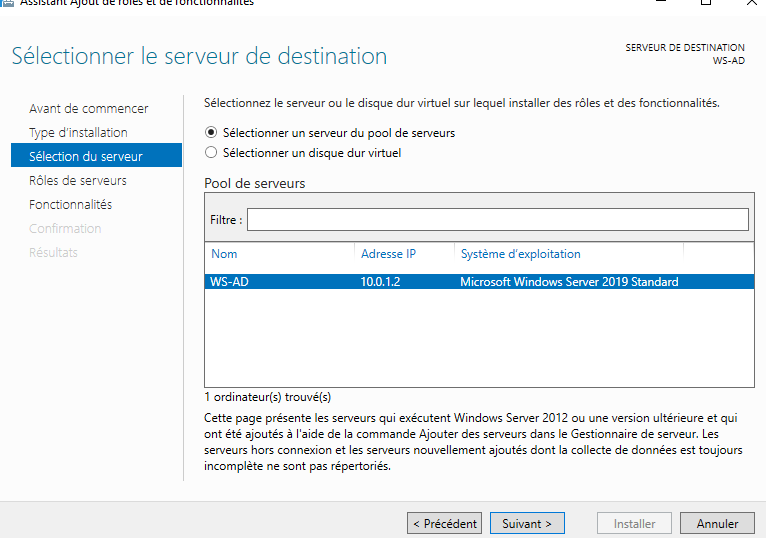

# Infra Documentation D'Architecture

## Table des matières

* [Présentation du projet](#présentation-du-projet)
    * [Cadre du projet](#cadre-du-projet)
    * [Objectifs](#objectifs)
    * [Réalisations](#réalisations)
* [Présentation de l'architecture réseau](#présentation-de-larchitecture-réseau)
    * [Schéma de l'architecture](#schéma-de-larchitecture)
    * [Tableau d'adressage](#tableau-dadressage)
    * [Explication de l'architecture](#explication-de-larchitecture)
* [Mise en place de la solution](#mise-en-place-de-la-solution)
    * [PFSense](#pfsense)
        * [Installation](#installation)
        * [Configuration](#configuration)
        * [Configuration du réseau](#configuration-du-réseau)
    * [Active Directory](#active-directory)
        * [Installation](#installation-1)
        * [Configuration](#configuration-1)
    * [Serveur Web](#serveur-web)
        * [Installation](#installation-2)
        * [Configuration](#configuration-2)
    * [Serveur de messagerie](#serveur-de-messagerie)
        * [Installation](#installation-3)
        * [Configuration](#configuration-3)
* [Conclusion](#conclusion)

## Présentation du projet

Nous sommes Olivier MISTRAL et Pierre ROY, étudiants en 2ème année Bachelor à Ynov Informatique.

### Cadre du projet

Dans le cadre de notre unité d'enseignement “Infrastructure & Système d’information”, nous avons réalisé un projet
visant à évaluer les compétences acquises au cours des modules de cette unité. Cette documentation présente la mise en
place de l'architecture réseau que nous avons réalisé dans le cadre de ce projet.   
Ce projet consiste à mettre en place une architecture réseau pour une entreprise lambda. Cette architecture doit
permettre de répondre aux besoins de l'entreprise, à savoir : avoir une sécurité de son réseau via un parefeu, que ses
collaborateurs puissent s’authentifier et ouvrir leur propre session, qu’ils puissent envoyer des mails en
interne dans un premier temps, et accéder à un intranet.

### Objectifs

Les objectifs de ce projet étaient les suivants:

- Configurer et administrer un serveur
- Gérer un environnement virtuel
- Mettre en place une infrastructure système et réseaux
- Appréhender la sécurité

### Réalisations

Notre projet a consisté à:

- Configurer un pare-feu PFSense
- Configurer un Active Directory pour gérer les utilisateurs
- Configurer un serveur de messagerie interne
- Configurer un serveur web pour l'intranet
- Respecter les règles de sécurité afin de protéger le réseau (cloisonnement des réseaux, etc.)

## Présentation de l'architecture réseau

### Schéma de l'architecture

### Tableau d'adressage

|                          | Lan 0/Admin | Lan 1/AD    | Lan 2/Web-Mail | Lan 3/Clients |
|:-------------------------|-------------|-------------|----------------|---------------|
| Sous réseau              | 10.0.0.0/24 | 10.0.1.0/24 | 10.0.2.0/24    | 10.0.3.0/24   |
| Passerelle/Interface LAN | 10.0.0.1    | 10.0.1.1    | 10.0.2.1       | 10.0.3.1      |
| Serveur                  |             | 10.0.1.x    | 10.0.2.x       |               |
| Client                   | 10.0.0.x    |             |                | 10.0.3.x      |

### Explication de l'architecture

L'architecture réseau est composée de 4 LANs, un pour l'administration, un pour l'Active Directory, un pour le serveur
web ainsi que la messagerie (DMZ) et un pour les clients. Chaque LAN est cloisonné par un pare-feu PFSense.
  Lan 0/Admin : Ce LAN est réservé à l'administration du réseau, il est donc accessible uniquement par les
administrateurs.
 Lan 1/AD : Ce LAN est réservé à l'Active Directory, il est donc accessible uniquement par les administrateurs et les
utilisateurs du domaine.
 Lan 2/Web-Mail (DMZ) : Ce LAN est réservé au serveur web et à la messagerie, il est donc accessible uniquement par les
administrateurs et les utilisateurs du domaine.
 Lan 3/Clients : Ce LAN est réservé aux clients, il est donc accessible uniquement par les administrateurs et les
utilisateurs du domaine.

## Mise en place de la solution

### PFSense

## Installation des machines

### PFSense

#### Installation

PFSense est un outil de surveillance de la sécurité du réseau. Il permet de surveiller les connexions et les
déconnexions des utilisateurs. 
Pour l'installer, il suffit de télécharger un ISO sur le site de la communauté de PFSense, puis de l'installer sur le
serveur.

L'installation ne requiert pas d'autres étapes, une fois lancée PFSense est prêt à être utilisé.

#### Configuration

Une fois PFSense installé, il faut le configurer.

Une fois le copyright accepté, un menu d'installation est disponible.

PFSense demande de choisir un clavier et un groupe de raccourcis à utiliser, nous utilisons celui de base.

Configuration des partitions du disque dur.

Validation de la configuration à installer.

PFSense demande de choisir un type d'utilisation de disque dur à plusieurs partitions, nous utilisons le type de disque
dur par défaut.

Validation de la configuration du disque dur.

La machine demande de formater les partitions, il faut appuyer sur * pour les sélectionner toutes.

PFSense s'installe après le formatage des partitions.

Une fois l'installation terminée, PFSense nous propose d'ouvrir un terminal pour finaliser notre installation. 
Le projet n'a pas besoin d'autre configuration.

PFSense est maintenant configuré et averti qu'il va redémarrer.

#### Configuration du réseau

Le terminal de PFSense, nous allons définir les adresses IP des différents LANs en choisissant l'option 2.

Pour l'exemple, nous allons configurer le LAN 0/Admin. Dans notre configuration, le LAN 0/Admin est sur l'interface 4.
 Il faut donc ensuite définit l'adresse IP de l'interface 4 ainsi que le masque de sous-réseau.

Choix des options pour ne pas mettre de DHCP et de ne pas utiliser IPv6 et d'autres options. 
Puis nous ferons la même chose pour les autres LANs.

Voilà ce que donne la configuration des interfaces.

Une fois les interfaces configurées, PFSense créé un site local via son adresse IP pour pouvoir configurer des règles. 
Il faut se connecter au site pour pouvoir configurer les règles (par défaut le nom de compte est admin et le mot de
passe est pfsense).

> Note :
> Le pare-feu va bloquer le rafraîchissement de notre page donc taper la commande `pfctl -d` dans le terminal du
> PfSense,
> qui va désactiver le pare-feu pour nous permettre d’affecter nos changements. 
> 

#### Les règles PFSense :

Nous pouvons maintenant ajouter une règle de PFSense.
Définition de la règle pour ouvrir le port 80.

Une fois la règle créée, nous pouvons tester si elle est bien active.

Le ping fonctionne, la règle est bien active.

### Windows Server 2019

#### Configuration

Plusieurs bonnes pratiques sont à respecter lors de l'installation d'un serveur Windows Server 2019 :

D'abord, nous changeons le nom de la machine pour qu'il soit plus facile à identifier.

Nous changeons l'adresse IP de la machine pour qu'elle soit dans le même réseau que le serveur PFSense. 
Puis, nous installons aussi les mises à jour de Windows Server 2019. 

Maintenant que le serveur est prêt, nous pouvons installer le rôle Active Directory.

Nous choisissons d'installer de nouveaux rôles sur le serveur.

Nous choisissons le rôle Active Directory et nous choisissons le serveur sur lequel l'installer.

Nous choisissons les options par défaut et vérifions que tout est correct. 
L'installation du rôle Active Directory est maintenant terminée.

Nous pouvons maintenant déployer le serveur en tant que contrôleur de domaine.

Nous choisissons de créer un nouveau domaine dans une nouvelle forêt. 
Le nom de domaine sera `infra.com` pour le projet.

Nous choisissons le niveau fonctionnel de la forêt et du domaine et nous choisissons le mot de passe du mode de
restauration des services d'annuaire.

Nous choisissons les options par défaut jusqu'à la fin de l'installation et nous vérifions que tout est correct.

#### Configuration des utilisateurs

Nous pouvons maintenant créer des utilisateurs pour le domaine.

Nous créons les Unités d'Organisation Admin et Client pour les utilisateurs et les groupes.

Exemple de création d'un utilisateur dans l'Unité d'Organisation Admin.

Puis nous ajoutons l'utilisateur dans le groupe Administrateurs.

#### Configuration du DNS

Nous allons maintenant configurer le DNS sur le serveur Windows Server 2019. 
Le serveur DNS va permettre de faire la résolution de nom de domaine. 
Une zone de recherche directe est déjà créée par défaut pour le domaine `infra.com`.

Nous allons ajouter une zone de recherche inversée pour le domaine `infra.com`.

Choix des options par défaut pour la zone de recherche inversée.

Nous créons un nouveau pointeur pour la zone de recherche inversée.

Utilisation de la commande `nslookup` pour vérifier que le DNS fonctionne correctement. 
Puis nous pouvons ajouter un utilisateur dans le DNS.

### Serveur Web/Mail

### Client Windows

#### Configuration

Nous allons maintenant configurer le client Windows pour qu'il puisse rejoindre le domaine `infra.com`. 

Dans le Client Windows cela se configure dans les paramètres IPv4.

