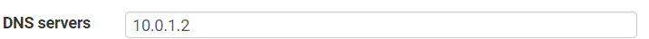
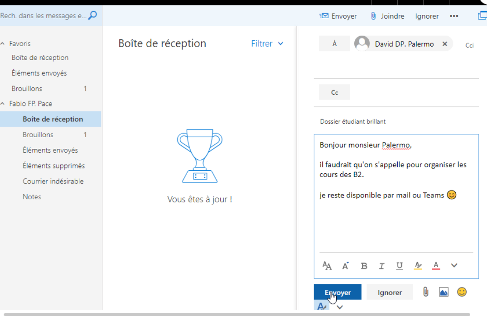

# Documentation d'architecture technique - Projet Infrastructure & Système d'information

## Membres du projet
- Olivier MISTRAL
- Pierre ROY

## Table des matières

* [Présentation du projet](#présentation-du-projet)
    * [Cadre du projet](#cadre-du-projet)
    * [Objectifs](#objectifs)
    * [Réalisations](#réalisations)
* [Présentation de l'architecture réseau](#présentation-de-larchitecture-réseau)
    * [Schéma de l'architecture](#schéma-de-larchitecture)
    * [Tableau d'adressage](#tableau-dadressage)
    * [Explication de l'architecture](#explication-de-larchitecture)
* [Mise en place de la solution](#mise-en-place-de-la-solution)
    * [PFSense](#pfsense)
        * [Installation](#installation)
        * [Configuration](#configuration)
        * [Configuration du réseau](#configuration-du-réseau)
        * [Configuration du DHCP](#configuration-du-dhcp)
        * [Configuration des règles du pare-feu](#configuration-des-règles-du-pare-feu)
        * [Configuration de la sauvegarde](#configuration-de-la-sauvegarde)
    * [Active Directory](#active-directory)
        * [Installation](#installation-1)
        * [Configuration](#configuration-1)
        * [Configuration des utilisateurs](#configuration-des-utilisateurs)
        * [Configuration du DNS](#configuration-du-dns)
    * [Serveur de messagerie](#serveur-de-messagerie)
        * [Installation](#installation-2)
        * [Configuration](#configuration-2)
        * [Utilisation de la messagerie](#utilisation-de-la-messagerie)
    * [Serveur Web](#serveur-web)
    * [Client Windows](#client-windows)
        * [Configuration](#configuration-3)
* [Conclusion](#conclusion)

## Présentation du projet

Nous sommes Olivier MISTRAL et Pierre ROY, étudiants en 2ème année Bachelor à Ynov Informatique.

### Cadre du projet

Dans le cadre de notre unité d'enseignement “Infrastructure & Système d’information”, nous avons réalisé un projet
visant à évaluer les compétences acquises au cours des modules de cette unité. Cette documentation présente la mise en
place de l'architecture réseau que nous avons réalisé dans le cadre de ce projet. <br><br>
Ce projet consiste à mettre en place une architecture réseau pour une entreprise lambda. Cette architecture doit
permettre de répondre aux besoins de l'entreprise, à savoir : avoir une sécurité de son réseau via un parefeu, que ses
collaborateurs puissent s’authentifier et ouvrir leur propre session, qu’ils puissent envoyer des mails en
interne dans un premier temps, et accéder à un intranet.

### Objectifs

Les objectifs de ce projet étaient les suivants :

- Configurer et administrer un serveur
- Gérer un environnement virtuel
- Mettre en place une infrastructure système et réseaux
- Appréhender la sécurité

### Réalisations

Notre projet a consisté à :

- Configurer un pare-feu PFSense
- Configurer un Active Directory pour gérer les utilisateurs
- Configurer un serveur de messagerie interne
- Configurer un serveur web pour l'intranet
- Respecter les règles de sécurité afin de protéger le réseau (cloisonnement des réseaux, etc.)

## Présentation de l'architecture réseau

### Schéma de l'architecture


### Tableau d'adressage

|                          | Lan 0/Admin | Lan 1/AD    | Lan 2/Web-Mail | Lan 3/Clients |
|:-------------------------|-------------|-------------|----------------|---------------|
| Sous réseau              | 10.0.0.0/24 | 10.0.1.0/24 | 10.0.2.0/24    | 10.0.3.0/24   |
| Passerelle/Interface LAN | 10.0.0.1    | 10.0.1.1    | 10.0.2.1       | 10.0.3.1      |
| Serveur                  |             | 10.0.1.x    | 10.0.2.x       |               |
| Client                   | 10.0.0.x    |             |                | 10.0.3.x      |

### Explication de l'architecture

L'architecture réseau est composée de 4 LANs, un pour l'administration, un pour l'Active Directory, un pour le serveur
web ainsi que la messagerie (DMZ) et un pour les clients. Chaque LAN est cloisonné par un pare-feu PFSense.
<br><br>Lan 0/Admin : Ce LAN est réservé à l'administration du réseau, il est donc accessible uniquement par les
administrateurs.
<br>Lan 1/AD : Ce LAN est réservé à l'Active Directory, il est donc accessible uniquement par les administrateurs et les
utilisateurs du domaine.
<br>Lan 2/Web-Mail (DMZ) : Ce LAN est réservé au serveur web et à la messagerie, il est donc accessible uniquement par
les
administrateurs et les utilisateurs du domaine.
<br>Lan 3/Clients : Ce LAN est réservé aux clients, il est donc accessible uniquement par les administrateurs et les
utilisateurs du domaine.

## Mise en place de la solution

### PFSense

#### Installation

PFSense est un outil de surveillance de la sécurité du réseau. Il permet de surveiller les connexions et les
déconnexions des utilisateurs.<br>
Pour l'installer, il suffit de télécharger un ISO sur le site de la communauté de PFSense, puis de l'installer sur le
serveur.


L'installation ne requiert pas d'autres étapes, une fois lancée PFSense est prêt à être utilisé.

#### Configuration

Une fois PFSense installé, il faut le configurer.


Une fois le copyright accepté, un menu d'installation est disponible.


PFSense demande de choisir un clavier et un groupe de raccourcis à utiliser, nous utilisons celui de base.


Configuration des partitions du disque dur.


Validation de la configuration à installer.


PFSense demande de choisir un type d'utilisation de disque dur à plusieurs partitions, nous utilisons le type de disque
dur par défaut.


Validation de la configuration du disque dur.


La machine demande de formater les partitions, il faut appuyer sur * pour les sélectionner toutes.


PFSense s'installe après le formatage des partitions.


Une fois l'installation terminée, PFSense nous propose d'ouvrir un terminal pour finaliser notre installation.<br>
Le projet n'a pas besoin d'autre configuration.


PFSense est maintenant configuré et averti qu'il va redémarrer.

#### Configuration du réseau


Le terminal de PFSense, nous allons définir les adresses IP des différents LANs en choisissant l'option 2.


Pour l'exemple, nous allons configurer le LAN 0/Admin. Dans notre configuration, le LAN 0/Admin est sur l'interface 4.
<br>Il faut donc ensuite définit l'adresse IP de l'interface 4 ainsi que le masque de sous-réseau.


Choix des options pour ne pas mettre de DHCP et de ne pas utiliser IPv6 et d'autres options.<br>
Puis nous ferons la même chose pour les autres LANs.


Voilà ce que donne la configuration des interfaces.


Une fois les interfaces configurées, PFSense créé un site local via son adresse IP pour pouvoir configurer des
règles.<br>
Il faut se connecter au site pour pouvoir configurer les règles (par défaut le nom de compte est admin et le mot de
passe est pfsense).


> Note :
> Le pare-feu va bloquer le rafraîchissement de notre page donc taper la commande `pfctl -d` dans le terminal du
> PfSense,
> qui va désactiver le pare-feu pour nous permettre d’affecter nos changements.<br>
> 

#### Configuration du DHCP

Notre serveur DHCP est le serveur PFSense, il faut donc le configurer pour qu'il puisse attribuer des adresses IP aux
clients. <br>

Pour cela, il faut aller dans l'onglet `Services` puis `DHCP Server`. Ensuite, on choisit sur quel LAN on veut
configurer le serveur DHCP. <br>


Après avoir choisi le LAN, il faut activer le serveur DHCP en cochant la
case `Enable DHCP server on LAN interface`. <br>


Ensuite, il faut configurer le serveur DHCP en choisissant une plage d'adresses IP à attribuer aux clients. <br>



On choisit ensuite le serveur DNS à utiliser, dans notre cas, nous utilisons le serveur DNS de notre Active Directory.


Enfin, on configure la passerelle par défaut, dans notre cas, nous utilisons l'adresse IP de notre serveur PFSense

#### Configuration des règles du pare-feu

Concernant les règles de pare-feu, nous allons paramétrer les règles de base pour chaque LAN. <br>
Pour cela, il faut aller dans l'onglet `Firewall` puis `Rules`. Ensuite, on choisit sur quel LAN on veut configurer les
règles. <br>

Une fois la LAN choisie, on clique sur `Add` pour ajouter une règle. <br> <br>
Dans notre cas la règle la plus importante est celle qui permet de bloquer les connexions venant du WAN vers le LAN du
serveur web et mail. En effet, comme il s'agit d'un intranet, nous ne voulons pas que des personnes extérieures puissent
accéder à ces services. <br> <br>
Concernant les autres règles, cela dépend les besoins de chaque entreprise. Par exemple, une entreprise manipulant des
données sensibles peut vouloir bloquer l'accès à certains sites internet voir bloquer l'accès à internet tout court.
Mais si l'entreprise souhaite que ses employés puissent accéder à internet, elle peut vouloir bloquer l'accès à certains
sites internet comme les réseaux sociaux ou les sites de streaming. <br>

#### Configuration de la sauvegarde

Nous allons maintenant configurer la sauvegarde automatique de la configuration de PFSense.


Pour cela, il faut aller dans l'onglet `Services` puis `Auto Config Backup`.


Il faut ensuite activer la sauvegarde automatique en cliquant sur `Enable` puis en choisissant la fréquence de
sauvegarde. <br>
Dans notre cas, nous allons activer la sauvegarde automatique lors de chaque modification de la configuration.


Ainsi lors de chaque modification de la configuration, PFSense va sauvegarder la configuration dans un fichier XML. La
liste des sauvegardes est disponible dans l'onglet `Restore`. <br>
Si nous voulons restaurer une sauvegarde, il suffit de cliquer sur l'image de restauration de la sauvegarde voulue.


PFSense nous demande ensuite si nous voulons restaurer la sauvegarde, il faut cliquer sur `OK`. <br> <br>
La restauration de la sauvegarde de la configuration est maintenant terminée.

### Active Directory

#### Installation

Plusieurs bonnes pratiques sont à respecter lors de l'installation d'un serveur Windows Server 2019 :


D'abord, nous changeons le nom de la machine pour qu'il soit plus facile à identifier.


Nous changeons l'adresse IP de la machine pour qu'elle soit dans le même réseau que le serveur PFSense.<br>
Puis, nous installons aussi les mises à jour de Windows Server 2019.<br>

#### Configuration


Maintenant que le serveur est prêt, nous pouvons installer le rôle Active Directory.


Nous choisissons d'installer de nouveaux rôles sur le serveur.


Nous choisissons le rôle Active Directory et nous choisissons le serveur sur lequel l'installer.


Nous choisissons les options par défaut et vérifions que tout est correct.<br>
L'installation du rôle Active Directory est maintenant terminée.


Nous pouvons maintenant déployer le serveur en tant que contrôleur de domaine.


Nous choisissons de créer un nouveau domaine dans une nouvelle forêt.<br>
Le nom de domaine sera `infra.com` pour le projet.


Nous choisissons le niveau fonctionnel de la forêt et du domaine et nous choisissons le mot de passe du mode de
restauration des services d'annuaire.


Nous choisissons les options par défaut jusqu'à la fin de l'installation et nous vérifions que tout est correct.

#### Configuration des utilisateurs


Nous pouvons maintenant créer des utilisateurs pour le domaine en allant dans l'onglet
"Utilisateurs et ordinateurs Active Directory".


Nous créons les Unités d'Organisation Admin et Client pour les utilisateurs et les groupes.


Exemple de création d'un utilisateur dans l'Unité d'Organisation Admin.


Puis, nous ajoutons l'utilisateur dans le groupe Administrateurs.

#### Configuration du DNS

Nous allons maintenant configurer le DNS sur le serveur Windows Server 2019.<br>
Le serveur DNS va permettre de faire la résolution de nom de domaine.<br>
Une zone de recherche directe est déjà créée par défaut pour le domaine `infra.com`.


Nous allons ajouter une zone de recherche inversée pour le domaine `infra.com`.

[//]: # (![Configuration du DNS 2]&#40;windows-server-dns-2.png&#41;)

[//]: # (![Configuration du DNS 3]&#40;windows-server-dns-3.png&#41;)

[//]: # (![Configuration du DNS 4]&#40;windows-server-dns-4.png&#41;)

[//]: # (![Configuration du DNS 5]&#40;windows-server-dns-5.png&#41;)


[//]: # (![Configuration du DNS 7]&#40;windows-server-dns-7.png&#41;)

Concernant les options à choisir on laisse les options par défaut sauf dans le nom de la zone de recherche inversée où
on indique le début de l'adresse IP du serveur Windows Server 2019. Ainsi, la zone de recherche inversée sera
`10.0`.<br>
On fait ceci pour que le serveur DNS puisse faire la résolution de nom de domaine et de toutes les adresses IP du
réseau.

[//]: # (![Configuration du DNS 8]&#40;windows-server-dns-8.png&#41;)

[//]: # ()

[//]: # (Nous créons un nouveau pointeur pour la zone de recherche inversée.)


On utilise la commande `nslookup` pour vérifier que la résolution de nom de domaine fonctionne bien. On vérifie aussi
que la résolution de nom de domaine inverse fonctionne bien.
<br> <br>
Notre serveur DNS est maintenant configuré.

### Serveur de messagerie

Pour le service de messagerie, nous allons utiliser le service de messagerie de Windows Exchange Server 2019.<br>
Nous allons installer le service de messagerie un nouveau serveur Windows Server 2019. <br>
Nous passerons donc les détails de l'installation du windows serveur ainsi que des bonnes pratiques à respecter lors de
l'installation, car nous l'avons déjà fait précédemment. <br>

#### Installation

Pour commencer, il faudra télécharger l'image ISO de Windows Exchange Server 2019 sur le site de Microsoft.<br>
Une fois l'image ISO téléchargée, nous pouvons lancer l'installation de Windows Exchange Server 2019.


On laisse les options par défaut pour la plupart des options, dans la partie "Sélection du rôle serveur" on choisit
`Rôle de boîte aux lettres`.


On continue alors jusqu'à demander le nom de l'organisation. On choisit `infra.com` pour le nom de l'organisation dans
notre cas. <br>
Après cela on continue jusqu'à la fin des configurations. <br>
Se lancera alors l'installation de Windows Exchange Server 2019 qui peut être excessivement longue. Une fois
l'installation terminée, on redémarre le serveur.

#### Configuration

Avant de configurer le serveur de messagerie, on va retourner dans l'Active Directory pour créer un nouvel utilisateur
qui sera le compte administrateur du serveur de messagerie. <br>


Par ailleurs, on se rend compte en retournant dans l'AD qu'une nouvelle Unité d'Organisation a été créée pour le serveur
de messagerie.


Afin de clarifier les choses, nous allons créer une Unité d'Organisation `Exchange` dans laquelle nous allons mettre le
ou les comptes administrateurs du serveur de messagerie. Il ne faut donc pas oublier de lui associer les droits
d'administrateur du serveur de messagerie.


Maintenant que le compte administrateur est créé, nous pouvons nous connecter au serveur de messagerie avec ce
compte. <br>
Pour cela, nous allons entrer l'url `https://localhost/ecp` dans un navigateur web. <br>
Cela nous permettra de nous connecter à l'interface d'administration du serveur de messagerie. <br>
Nous allons nous connecter avec le compte administrateur que nous venons de créer.


Nous arrivons alors sur l'interface d'administration du serveur de messagerie. <br>
De là, nous allons pouvoir configurer le serveur de messagerie. <br>


Dans notre cas nous allons ajouter une nouvelle boîte aux lettres pour l'utilisateur `Pace Fabio`.


On remplit alors l'alias de la boîte aux lettres, c'est-à-dire le suffixe de l'adresse mail. <br>
Et on n'oublie pas non plus de choisir l'utilisateur auquel on veut associer la boîte aux lettres. <br> <br>
Une fois cela fait, notre boîte aux lettres est créée et est prête à être utilisée.

#### Utilisation de la messagerie

Pour utiliser la messagerie, nous allons utiliser nous connecter sur une machine Client Windows. <br>
On inscrit alors dans l'url du navigateur web l'adresse IP du serveur de messagerie, ce qui nous permettra de nous
connecter à l'interface de connexion de la messagerie. <br>
On se connecte alors avec l'adresse mail et le mot de passe de l'utilisateur auquel on a associé la boîte aux lettres.


Nous voilà connecté à la messagerie sur le compte de l'utilisateur `Pace Fabio`. <br>



On peut alors envoyer un mail à un autre utilisateur de la messagerie. <br>


En se connectant sur la messagerie de l'utilisateur auquel on a envoyé le mail, on peut voir que le mail a bien été
reçu. <br> <br>

Ainsi, nous avons configuré un serveur de messagerie avec Windows Exchange Server 2019 et nous avons pu envoyer et
recevoir des mails sur notre domaine `infra.com`.

## Serveur Web

Pour le serveur web, nous allons utiliser le service Nginx. <br>
Nous allons installer le service Nginx sur une nouvelle machine Ubuntu. <br> <br>
Concernant les configurations de la machine Ubuntu, nous allons passer les détails de l'installation du système,
car il n'y a rien de particulier à faire. <br>

On commence par mettre à jour les paquets de la machine Ubuntu.

```bash
sudo apt update
```

On installe ensuite le service Nginx.

```bash
sudo apt install nginx
```

Une fois l'installation terminée, on peut vérifier que le service Nginx est bien installé et qu'il fonctionne.

```bash
sudo systemctl status nginx
```

Une fois le service Nginx installé, on peut se connecter à l'adresse IP de la machine Ubuntu avec un navigateur
web. <br>
Ainsi, on peut voir que le service Nginx est bien installé et qu'il fonctionne. <br> <br>
Il reste maintenant à personnaliser la page d'accueil du serveur web afin qu'elle corresponde à notre
domaine `infra.com`. <br>
Étant donné que dans notre cas, il s'agit d'un projet de test, nous laisserons la page d'accueil par défaut de
Nginx. <br> <br>

Ainsi, nous avons configuré un serveur web avec Nginx sur une machine Ubuntu. <br>
Ce dernier est accessible depuis les autres machines du réseau local via l'adresse IP de la machine Ubuntu.

### Client Windows

Nous allons maintenant configurer le client Windows pour qu'il puisse rejoindre le domaine `infra.com`.<br>

> Important ! <br>
> La version de windows utilisée ne doit pas être une version familiale, car ces dernières ne permettent pas de
> rejoindre
> un domaine.

#### Configuration

Pour commencer, nous allons configurer le client Windows pour qu'il puisse rejoindre le domaine `infra.com`. <br>


Pour cela, on se rend dans les paramètres de la machine Windows, puis dans les paramètres avancés pour pouvoir changer
le nom de la machine. <br>
On a alors sur le bas de la fenêtre la possibilité de rejoindre un domaine. <br>
Dans notre cas, nous allons renseigner le nom de domaine `infra.com` et nous allons cliquer sur le bouton `OK`. <br>


On nous demande alors de nous connecter avec un compte administrateur du domaine. <br>
On se connecte alors avec le compte administrateur du domaine `infra.com`. <br>


Un message nous indique alors que la machine a bien été ajoutée au domaine `infra.com`. <br>


Au redémarrage de la machine, on peut voir que l'on peut se connecter avec un compte du domaine `infra.com`. <br> <br>
Voilà, notre machine Windows est maintenant bien connectée au domaine `infra.com`. <br> <br>
Elle est donc maintenant prête à être utilisée et à utiliser les différents services du domaine `infra.com` comme le
serveur de messagerie ou l'intranet.

## Conclusion

Pour conclure ce projet, nous avons pu mettre en place un domaine `infra.com` avec un serveur DNS, un serveur DHCP, un
serveur de messagerie et un intranet. <br>


